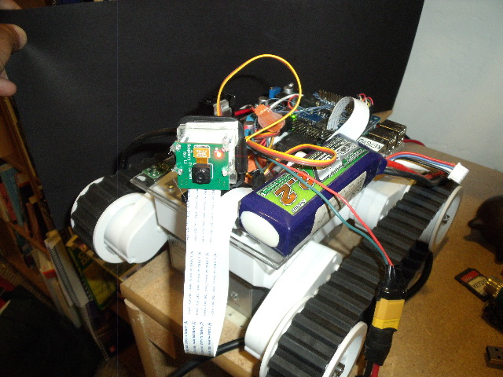
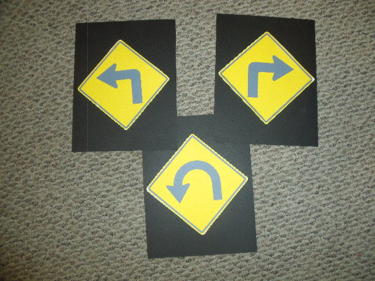

# robot-louie
Arm based robot with camera / compass and odometers. Decode and follow road signs

  
  

Experiments using OpenCV and Raspberry Pi as a robot controller. The control software is written in a combination of Python and C++.

The robot has sensors for direction, distance (odometry) and vision. The robot uses routines from the OpenCV library to detect and classify roadsigns. 

This robot is a work in progress -- No, it doesn't follow dogs (yet).

Runnable code is in PytonSources/GetSign.py

Douglas Todd

